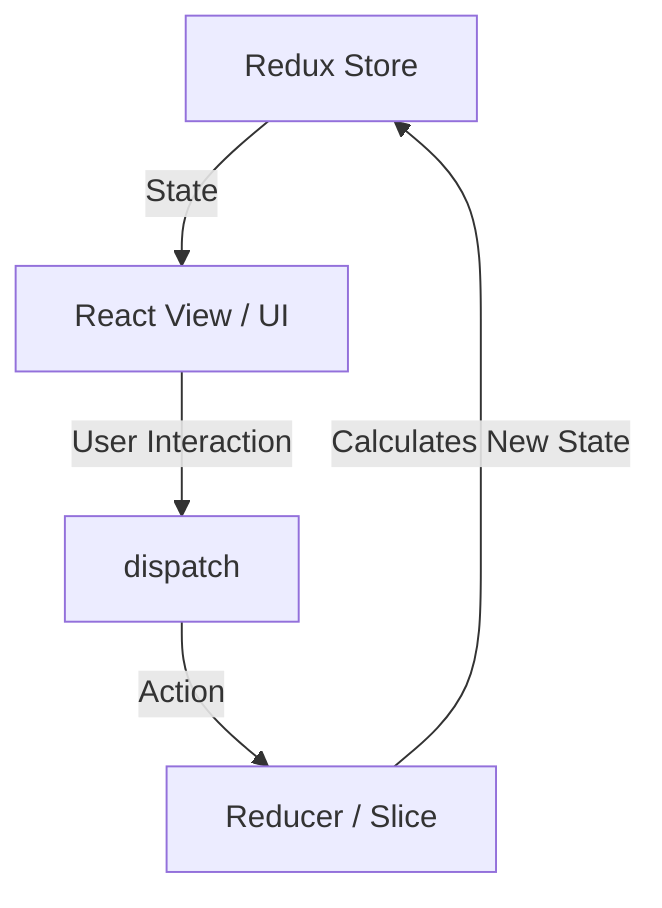

# Redux Toolkit (RTK) - Developer Reference & Notes

This guide is designed as an interactive reference for your future self to quickly understand Redux Toolkit (RTK), why it is used, its core concepts, architecture patterns, and the practical learnings from building a Redux-powered CRUD Todo application.

---

## 1. Introduction to Redux Toolkit (RTK)
**Redux Toolkit** is the official, opinionated, batteries-included toolset for efficient Redux development. 

Historically, standard Redux was notorious for its high amount of boilerplate, complex setup steps, and the need to manually install additional packages (such as `redux-thunk` for async code or `reselect` for selectors). Redux Toolkit was introduced to solve these issues, acting as a standardized abstraction layer over raw Redux.

---

## 2. Why Redux Toolkit is Used
RTK is used to write standard Redux apps but with **less code, fewer packages, and fewer configurations**.
* **Zero Boilerplate:** Actions, action creators, and action types are generated automatically when writing reducers.
* **Simplified Store Configuration:** `configureStore` combines middleware, devTools configuration, and reducers automatically.
* **Immutability Made Easy:** It embeds **Immer**, which allows developers to write "mutating" updates (like `.push()` or `.find()`) inside reducers. Immer intercepts these operations and performs safe, immutable updates under the hood.
* **Built-in Async Utilities:** It includes `createAsyncThunk` out-of-the-box to handle server side communication.

---

## 3. Core Concepts

Redux follows a **predictable, centralized state container** pattern. Here are the core building blocks:



| Concept | Explanation |
| :--- | :--- |
| **Store** | The single, centralized database containing the entire state tree of your application. |
| **Slice** | A collection of Redux reducer logic and actions for a single feature of your app. |
| **Actions** | Simple JavaScript objects with a `type` and an optional `payload`. They represent "what happened" in the app. |
| **Reducers** | Functions that take the current `state` and an `action`, and calculate the next state. |
| **Dispatch** | A function provided by Redux to trigger state updates by sending actions to the store. |
| **Selectors** | Utility functions that allow React components to query and select specific properties from the global state. |

---

## 4. Redux Data Flow (Unidirectional)

Redux strictly enforces a **one-way data flow**:

1. **User Action:** The user performs an action on the UI (e.g., clicks "Add Task").
2. **Action Dispatch:** The UI dispatches a formatted action creator (e.g., `addTodo("Buy Groceries")`) using the `useDispatch` hook.
3. **Reducer Invocation:** The Redux Store catches the action and runs the corresponding reducer function in the feature slice.
4. **State Transition:** The reducer updates the state (leveraging Immer under the hood).
5. **View Update:** Components subscribed to the state via `useSelector` detect changes, retrieve the updated data, and trigger a re-render.

---

## 5. Folder Structure

The project follows a **Feature-Folder Pattern** (RTK standard) to keep related logic modular and clean:

```
redux-mini-hackthon/
├── index.html            # App entry index page
├── vite.config.js        # Vite + Tailwind compiler configuration
├── src/
│   ├── main.jsx          # Mounts application and wraps it in the Redux <Provider>
│   ├── App.jsx           # Main coordinator with Tab navigation
│   ├── index.css         # Imports Tailwind v4 utility styles
│   ├── store/
│   │   └── store.jsx     # Sets up configureStore and subscribes to localStorage
│   ├── features/
│   │   └── todoSlice.jsx # RTK Slice containing actions, reducers, and initial state
│   └── components/
│       ├── AddTodo.jsx   # Input form that dispatches creation actions
│       ├── Todo.jsx      # List element rendering tasks, search, filter, and edit states
│       └── DocumentationView.jsx # Live in-app documentation guide
```

---

## 6. Important Functions

Here are the API functions utilized in this project:

### `configureStore()`
Sets up the Redux Store. We pass our reducer slices here. It automatically enables Redux DevTools and sets up middlewares:
```javascript
export const store = configureStore({
  reducer: {
    todo: todoReducer,
  },
});
```

### `createSlice()`
Handles feature setup. It takes a name, initial state, and an object of reducer methods:
```javascript
export const todoSlice = createSlice({
  name: 'todos',
  initialState,
  reducers: {
    toggleTodo: (state, action) => {
      const todo = state.todos.find(t => t.id === action.payload);
      if (todo) todo.completed = !todo.completed;
    }
  }
});
```

### `useSelector()`
React Hook to read values from the Redux state:
```javascript
const todos = useSelector((state) => state.todo.todos);
```

### `useDispatch()`
React Hook to trigger action updates:
```javascript
const dispatch = useDispatch();
dispatch(toggleTodo(id));
```

### `prepare` callback
Allows customizing the action payload before it reaches the reducer (e.g., generating dynamic IDs or timestamps):
```javascript
addTodo: {
  reducer: (state, action) => { state.todos.push(action.payload); },
  prepare: (text) => ({ payload: { id: nanoid(), text, completed: false } })
}
```

---

## 7. Personal Notes & Cheat Sheet
* **Immer is a lifesaver:** Never return new arrays directly if you modify state in place. Either mutate the draft directly (e.g. `state.push(item)`) or return a brand new state (e.g. `return state.filter(...)`), but **don't mix both**.
* **LocalStorage Synchronization:** In standard web apps, subscribing to store changes is a clean way to handle state preservation:
  ```javascript
  store.subscribe(() => {
    localStorage.setItem("key", JSON.stringify(store.getState().reducerName));
  });
  ```
* **Keep selectors clean:** When queries become complex, consider using selectors to filter states rather than cluttering component renders.

---

## 8. Real-world Use Cases
1. **Shopping Carts:** Adding/removing items from a cart, updating quantities, calculating pricing across catalog, headers, and checkout pages.
2. **User Authentication:** Storing user profile tokens, authentication states, and access permissions that dictate dashboard routes.
3. **Offline Mode / Syncing:** Backing up application state to indexDB/localStorage and syncing records when internet connection returns.

---

## 9. Challenges Faced & Solutions
* **Challenge:** Dealing with state mutations and updating state variables without overriding other keys.
  * *Solution:* Using `createSlice` which uses Immer. This makes updating complex nested states simple since we write normal mutative code (`state.value = x`), and Immer creates a copy under the hood.
* **Challenge:** Syncing state updates safely to persistence layers.
  * *Solution:* Subscribing to the store in `store.jsx`. This decouples the view layers and components from saving logic entirely—any dispatch automatically updates localstorage seamlessly!

---

## 10. Additional Things Explored
* **Prepare Reducers:** Leveraging RTK `prepare` syntax to encapsulate business logic (creating random IDs and Date timestamps) within the slice action definition rather than the React view components.
* **Stat Progress Integration:** Built an active percentage math calculator to map out a status progress bar on top of the list view to render immediate visual feedback.
* **Dual-Pane App Hub:** Implemented tab navigation separating execution workspace from theoretical notes to improve developer focus.
